# WinSCP

## インストールの手順

### ダウンロード

下記サイトからWinSCPをダウンロードする  
https://forest.watch.impress.co.jp/library/software/winscp/

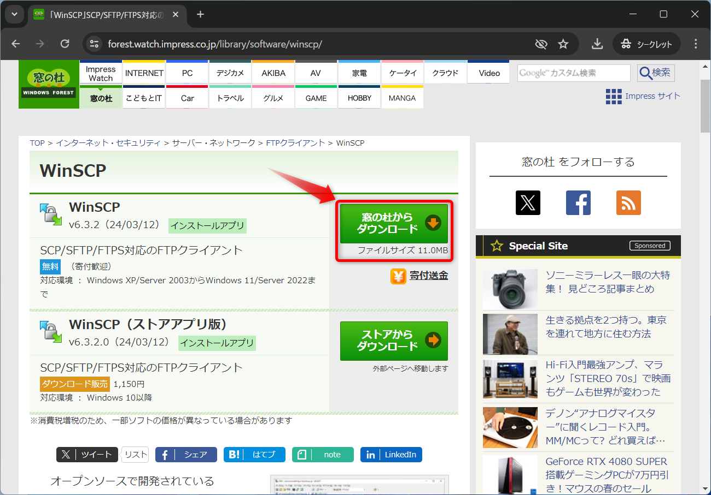

「ダウンロード」フォルダに保存する  
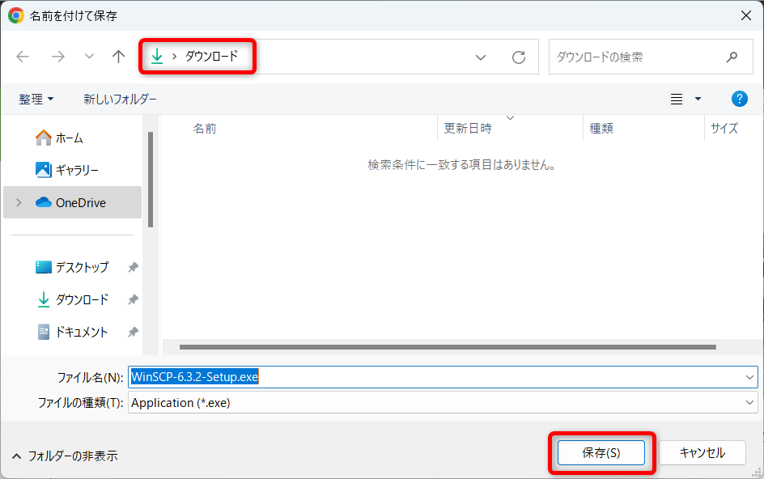

### インストール

ダウンロードしたファイルを実行  
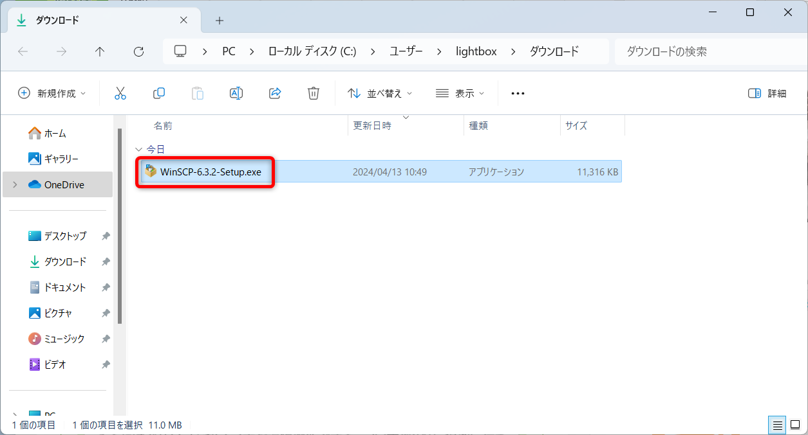

「現在のユーザー用にインストール」をクリック  
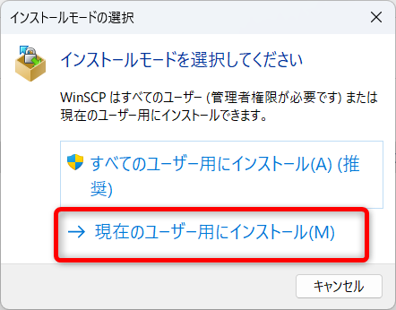

「許諾」をクリック  
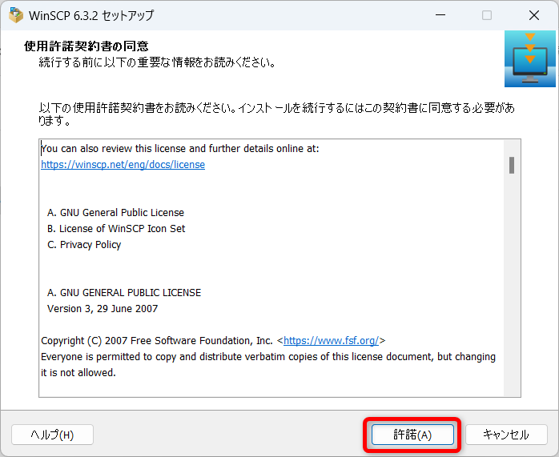

「次へ」をクリック  
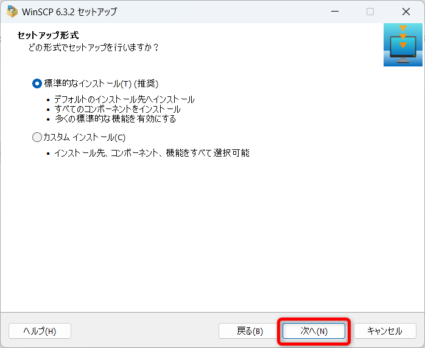

「次へ」をクリック  
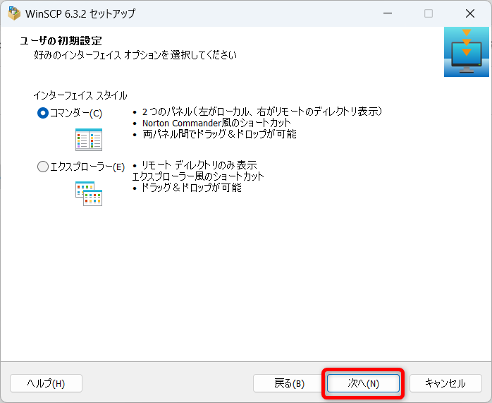

「インストール」をクリック  
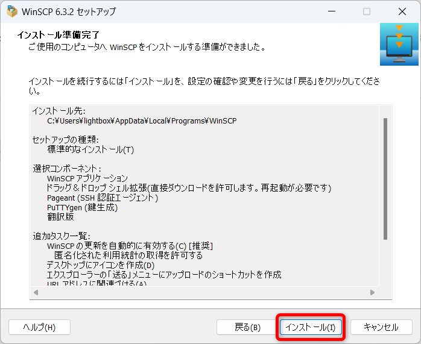

「スタートページを開く」のチェックを外す  
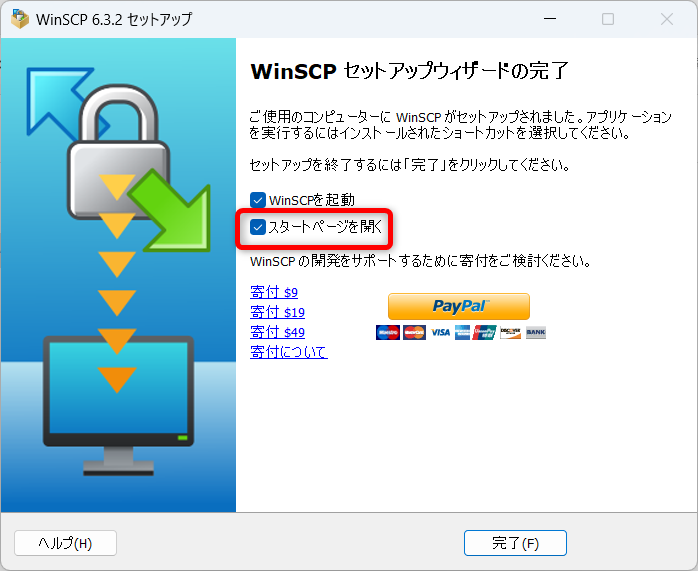

「完了」をクリック  
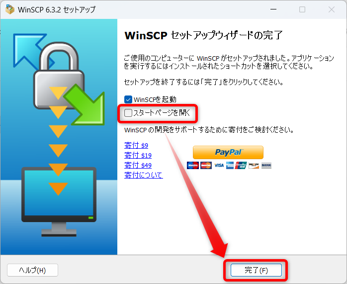

WinSCPが起動すればインストール完了
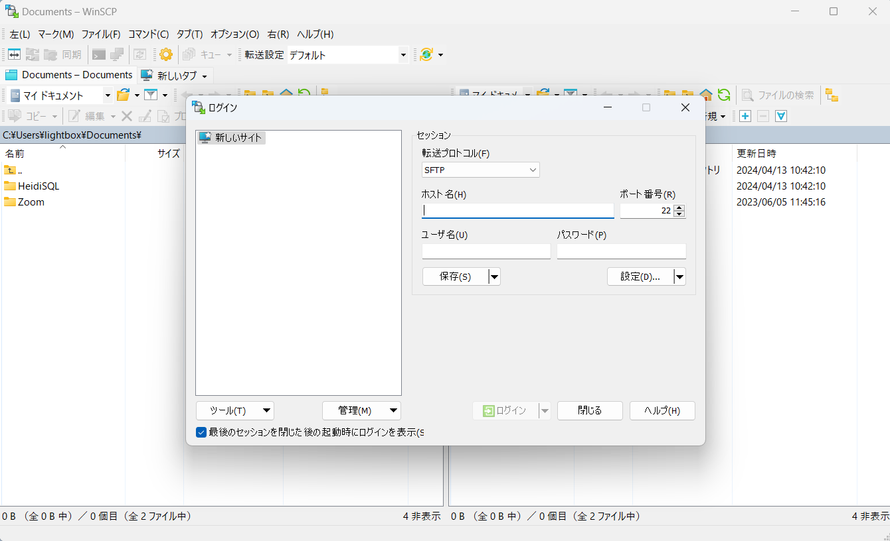
